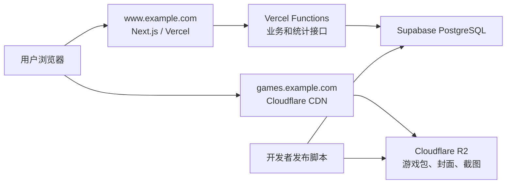

# MoYuFun MVP 初步方案 v0.2

## 1. 项目目标

建设一个类似 4399 的轻量级单机小游戏网站。游戏以 HTML/H5 静态文件形式运行，用户打开网站后即可选择并游玩，无需下载安装。

MVP 规模假设：

- 日活用户：约 100 人
- 每日游戏启动：约 300 次
- 游戏仅由内部开发者上传
- 单个游戏包在 30 MB 以内
- 暂不考虑搜索、推荐、评论、排行榜和第三方开发者入驻

## 2. MVP 功能范围

### 用户端

- 首页
  - 网站名称和基础介绍
  - 展示全部小游戏
  - 游戏排序
- 游戏详情页
  - 名称、封面、简介
  - 开始游戏按钮
- 游戏游玩页
  - 通过 `iframe` 加载 H5 游戏
  - 加载提示
  - 全屏、返回等基础操作
- 必要辅助页面
  - 隐私政策
  - 使用条款

### 数据统计

记录以下数据：

- 页面访问量
- 独立访客和访问会话
- 游戏详情页访问
- 游戏加载、开始和结束
- 游戏游玩时长

### 暂不开发

- 搜索
- 个性化推荐
- 分类和专题页
- 评论、评分、排行榜
- 云存档
- 完整运营管理后台
- 第三方开发者上传
- 微服务、Redis、消息队列

## 3. 产品验证指标

MVP 主要验证用户能否顺利发现、启动并持续游玩小游戏。核心指标如下：

| 指标 | 统计口径 |
|---|---|
| 详情访问率 | 访问过游戏详情页的会话数 / 首页会话数 |
| 开始游玩率 | 发生 `game_start` 的会话数 / 游戏详情页会话数 |
| 加载成功率 | 对应 `game_ready` 的加载次数 / `game_load` 次数 |
| 加载耗时 P75 | 同一会话中 `game_ready` 与 `game_load` 的时间差 |
| 有效游玩率 | 累计活跃游玩不少于 5 分钟的启动数 / `game_start` 数 |
| 7 日回访率 | 7 日内再次访问的匿名访客数 / 首次访问匿名访客数 |

浏览器首次访问站点时生成随机 `anonymous_id` 并保存在本地，同时生成 `session_id`；连续 30 分钟无活动后开始新会话。门户页面采集页面事件，游戏通过最小版 Game SDK 向父页面发送生命周期事件，父页面统一提交到 `/api/events`。服务端校验并去重后写入 PostgreSQL，通过 SQL 视图按天、游戏和版本汇总。应用不主动持久化原始 IP。

## 4. 总体架构



核心思路：

- 门户页面由 Vercel 托管
- 游戏文件保存在 Cloudflare R2
- Cloudflare 负责 DNS、CDN、HTTPS 和游戏文件缓存
- Supabase 提供 PostgreSQL 数据库
- Vercel Functions 承担服务端逻辑
- 不单独租赁或维护传统服务器

## 5. 技术选型

| 模块 | MVP 方案 |
|---|---|
| 网站框架 | Next.js |
| 网站部署 | Vercel |
| 服务端接口 | Next.js API / Vercel Functions |
| 数据库 | Supabase PostgreSQL |
| 游戏文件存储 | Cloudflare R2 |
| 游戏文件分发 | Cloudflare CDN |
| 域名解析 | Cloudflare DNS |
| 游戏上传 | 开发者本地发布脚本 |
| 错误监控 | Sentry，可选 |

## 6. 页面结构

```text
/                    首页
/games/[slug]        游戏详情页
/play/[slug]         游戏游玩页
/privacy             隐私政策
/terms               使用条款
/api/events          数据统计接口
```

首页暂不建设复杂运营系统，只在游戏数据中保留 `sort_order` 字段，由开发者调整展示顺序。

游戏详情页本身就是可被搜索引擎收录的页面。MVP 只实现基础 SEO：

- 页面标题和简介
- 分享图片
- `sitemap.xml`
- `robots.txt`
- 可读 URL

## 7. 游戏运行与 SDK

每个游戏是一个独立静态目录：

```text
games/
└── snake/
    ├── v1/
    │   ├── index.html
    │   ├── game.js
    │   └── assets/
    └── v2/
        ├── index.html
        └── assets/
```

游玩页通过独立域名加载：

```html
<iframe
  src="https://games.example.com/games/snake/v2/index.html"
  sandbox="allow-scripts allow-same-origin allow-pointer-lock"
  allow="fullscreen; autoplay"
  referrerpolicy="strict-origin-when-cross-origin"
></iframe>
```

游戏与门户分别运行在 `games.example.com` 和 `www.example.com`。游戏域名不设置 Cookie、不保存密钥，也不直接访问主站数据。主站使用 CSP 将 `frame-src` 限制为 `https://games.example.com`；Cloudflare 响应头转换规则设置 `Content-Security-Policy: frame-ancestors https://www.example.com` 和 `X-Content-Type-Options: nosniff`；iframe 只开放游戏需要的权限。

### 最小版 Game SDK

每个游戏接入同一个轻量 SDK，通过 `postMessage` 向父页面发送：

- 游戏加载完成
- 游戏开始
- 游戏结束
- 全屏请求

消息使用固定结构：

```json
{
  "source": "moyufun-game",
  "protocol_version": 1,
  "event_id": "uuid",
  "type": "game_ready",
  "occurred_at": "2026-08-04T12:00:00.000Z",
  "payload": {}
}
```

SDK 发送消息时指定 `targetOrigin=https://www.example.com`，不使用 `*`。父页面只接受来自 `https://games.example.com` 且 `event.source` 等于当前 iframe 的消息，并校验协议版本、事件类型和字段大小。`game_id`、`game_version_id`、`anonymous_id` 和 `session_id` 由父页面补充，不信任游戏传入的标识。父页面创建 iframe 时记录 `game_load`，在游戏开始且页面可见时每 30 秒记录一次 `game_heartbeat`，据此估算有效游玩时长。

## 8. 游戏上传与发布

MVP 不开发上传后台，由开发者通过本地命令发布：

```text
publish-game ./games/snake --version 2
```

发布流程：

1. 检查是否存在 `index.html`
2. 检查文件数量、文件类型和总大小
3. 上传到新的 R2 版本目录
4. 校验入口文件和已上传资源均可访问
5. 在事务中写入版本信息并设置为当前版本
6. 刷新网站页面缓存

游戏文件不覆盖旧版本。出现问题时，只需把当前版本从 `v2` 切换回 `v1`。

最低安全要求：

- R2 API 不开放匿名访问，并关闭 Bucket 的 `r2.dev` 公共地址
- 游戏文件只通过 `games.example.com` Custom Domain 公开
- R2 API Token 仅授予发布所需 Bucket 的对象读写权限
- R2 凭据只保存在开发者环境或 CI 中
- 密钥不进入浏览器和代码仓库
- 游戏使用独立域名
- iframe 仅开放必要权限
- 游戏包采用不可变版本目录

## 9. 数据设计

核心数据表：

```text
games
- id
- slug
- name
- description
- cover_url
- current_version_id
- status
- sort_order
- created_at
- updated_at
```

```text
game_versions
- id
- game_id
- version
- entry_path
- package_size_bytes
- published_at
```

约束：`games.slug` 唯一，`game_versions(game_id, version)` 唯一，`current_version_id` 外键指向 `game_versions.id`，`package_size_bytes` 不得超过 30 MB。

```text
events
- id
- event_id
- event_type
- session_id
- anonymous_id
- game_id
- game_version_id
- protocol_version
- occurred_at
- metadata
```

约束：`event_id` 唯一；为 `occurred_at`、`session_id`、`game_id` 和 `game_version_id` 建立索引。`metadata` 只保存事件所需字段并限制大小。

主要统计事件：

```text
page_view
game_detail_view
game_load
game_ready
game_start
game_heartbeat
game_end
```

前端将事件提交到 `/api/events`，Vercel Function 完成参数校验、去重和基础限流后写入数据库。

原始事件保留 90 天；日汇总数据长期保留。Supabase 禁止匿名客户端直接读写这些表，网站接口和发布脚本使用各自的最小权限服务端凭据。

## 10. 部署结构

### 域名

```text
www.example.com    → Vercel
games.example.com  → Cloudflare CDN → R2
```

API 暂时与主站共用域名：

```text
www.example.com/api/*
```

不需要单独配置 `api.example.com`。

### Vercel

部署以下内容：

- Next.js 页面
- 游戏目录接口
- 统计接口
- 基础统计查询
- 服务端环境变量

代码提交至 GitHub 后，可由 Vercel 自动构建和部署。

### Supabase

负责：

- PostgreSQL 数据库
- 数据库备份和托管
- 游戏信息、版本信息和统计事件

网站服务端密钥只配置在 Vercel 环境变量中；发布凭据只保存在开发者环境或 CI 中。

### Cloudflare R2 与 CDN

- R2 保存游戏包、封面和截图
- `games.example.com` 作为 R2 Custom Domain，并通过 Cloudflare CDN 缓存和分发文件
- Bucket 的 `r2.dev` 公共地址保持关闭，R2 API 仅允许凭据访问
- Cloudflare DNS 和 Universal SSL 负责域名解析与 HTTPS
- CORS 仅允许 `https://www.example.com` 发起 `GET` 和 `HEAD` 请求
- 响应头转换规则设置 `frame-ancestors` 和 `X-Content-Type-Options`
- 设置正确的 HTML、JavaScript、WASM、图片和音频类型
- 不可变版本文件设置长期缓存

## 11. 流量预估

每日 300 次游戏启动时：

按每次加载完整 30 MB 上限计算，每月理论流量约 270 GB；浏览器缓存和按需加载会降低实际流量。R2 不收取公网出口流量费，该规模下主要关注存储和操作请求量，并通过 CDN 缓存减少回源读取。

资源要求：

- 单个游戏包不得超过 30 MB
- 图片和音频压缩
- 大资源按需加载
- 版本资源使用长期缓存

## 12. 推荐实施顺序

1. 明确首发游戏、测试周期和产品验证指标
2. 注册域名，创建 Vercel、Supabase 项目和 Cloudflare R2 Bucket
3. 用一个真实游戏打通首页、详情页和 iframe 游玩页
4. 配置 R2、`games.example.com`、缓存、CORS 和安全响应头
5. 建立数据库表，实现最小版 Game SDK 和统计链路
6. 编写游戏发布脚本并验证版本切换和回滚
7. 添加隐私政策、基础 SEO 和错误监控
8. 上传 5～10 个游戏，完成桌面端和移动端链路测试
9. 正式开放 MVP，并按日查看核心指标

MVP 固定使用 Vercel、Supabase、Cloudflare R2 和 Cloudflare CDN，初版不根据用户所在地调整部署方案。
